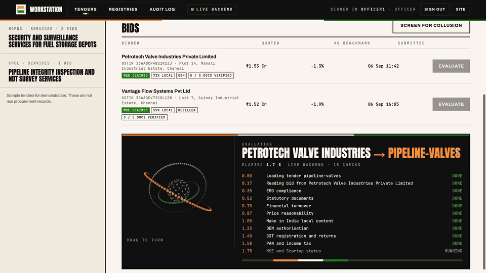

<p align="center">
  
</p>

<p align="center">
  <a href="https://procurement-pilot-sih.vercel.app"></a>
  <a href="https://youtu.be/D4A3Fv-sczU"></a>
  
  
  
  
  <a href="https://github.com/victorisaacchinta-eng/procurement-pilot-sih/actions/workflows/ci.yml"></a>
  
  
</p>

<h3 align="center">Registry-verified bid compliance for government procurement.<br>Code decides. AI explains. A named officer signs.</h3>

<p align="center"><a href="https://procurement-pilot-sih.vercel.app"><b>procurement-pilot-sih.vercel.app</b></a> &nbsp;·&nbsp; <a href="https://youtu.be/D4A3Fv-sczU"><b>watch the 4:52 demo</b></a></p>

<p align="center">
  <a href="#-see-it">See it</a> ·
  <a href="#-how-it-works">How it works</a> ·
  <a href="#-the-score">The score</a> ·
  <a href="#-the-fifteen-checks">Checks</a> ·
  <a href="#-all-fourteen-sih26100-outcomes">Coverage</a> ·
  <a href="#-quick-start">Quick start</a> ·
  <a href="#-the-3-minute-demo">Demo</a>
</p>


A procurement officer checking a GeM bid today opens portal after portal: GST, income tax, MCA21, Udyam, EPFO,
the debarment list, then the bid documents themselves. It is slow, and two officers can reach two different answers
on the same bid. Procurement Pilot runs **fifteen fixed checks** on every bid against **ten registry sources**,
scores it out of 100 with a risk level, explains every flag in plain language, and leaves the decision, and the
signature, to a named officer. Built by **Team Ace Azael** (ACE Engineering College, Hyderabad) for
**Smart India Hackathon 2026**, problem statement **SIH26100** from the Ministry of Petroleum and Natural Gas.

> [!NOTE]
> Student prototype. Not an official government system and not affiliated with or endorsed by any ministry or PSU.
> All tenders, bids, registry records, GSTINs, PANs, CINs and Udyam numbers here are **sample data**, and every
> registry lookup is labelled **simulated** in the app.

## ◆ See it

<p align="center">
  <a href="https://youtu.be/D4A3Fv-sczU"></a>
  <br><sub>The full walkthrough on YouTube, 4:52.</sub>
</p>

<p align="center">
  
  <br><sub>Real screens from the live build: 100, 89, the document check, 45 and the stamp, a written override, the collusion screen and the audit log.</sub>
</p>

## ◆ How it works

<p align="center">
  
</p>

<table>
<tr>
<td width="33%" valign="top">

**Checks in plain code**<br>
<sub>Fifteen deterministic checks. Each returns PASS, FLAG or FAIL with a sentence naming the real numbers and the source it checked. Same bid, same answer, every time.</sub>

</td>
<td width="33%" valign="top">

**One adapter per registry**<br>
<sub>GSTN, Income Tax, MCA21, Udyam, DPIIT, NSIC, EPFO, ESIC, DigiLocker and the GeM / CPPP debarment list. Going live means replacing one lookup function; the checks do not change.</sub>

</td>
<td width="33%" valign="top">

**It reads the documents**<br>
<sub>Upload a bid PDF: it pulls the GSTIN, PAN, Udyam, CIN, DPIIT number and legal name from the text layer and cross-checks each against the bid.</sub>

</td>
</tr>
<tr>
<td valign="top">

**AI that explains, never approves**<br>
<sub>A reasoning layer (Sarvam's <code>sarvam-105b</code>) writes the explanation. It cannot set the score or the verdict, PAN and GSTIN are masked before anything reaches it, and without a key the app falls back to a deterministic summary and says so.</sub>

</td>
<td valign="top">

**Collusion across bids**<br>
<sub>Every pair of bids on a tender is compared: prices within 0.5%, submissions within 5 minutes, shared addresses, cover bids more than 25% above the benchmark.</sub>

</td>
<td valign="top">

**A human signs, on the record**<br>
<sub>Officer, senior approver and admin roles are enforced by the server. Passing a flagged bid needs a senior approver and a written reason of 30+ characters. Every decision lands in the audit log.</sub>

</td>
</tr>
</table>

## ◆ The score

<p align="center">
  
</p>

The weights add up to 100. A FAIL on EMD, statutory documents, GST registration or debarment caps the score at
**45** and makes the risk **Critical**; any other FAIL caps it at **72** (**High**); any FLAG makes it **Medium**;
all PASS is **Low**. The workstation shows a *Why not 100* line with every point lost and why.

## ◆ The fifteen checks

| Family | Check | Weight | Checked against |
|---|---|---:|---|
| **Tender eligibility** | EMD compliance 🔻 | 10 | Bid record, Udyam / DPIIT / NSIC for exemptions |
|  | Statutory documents 🔻 | 10 | DigiLocker |
|  | Financial turnover | 10 | Bid record |
|  | Price reasonability | 8 | Tender benchmark |
|  | Make in India local content | 6 | Bid declaration (Class-I 50%+, Class-II 20%+) |
|  | OEM authorisation | 6 | Bid declaration |
| **Registry verification** | GST registration and returns 🔻 | 8 | GSTN, plus the real GSTIN check digit |
|  | PAN and income tax | 7 | Income Tax Department, PAN read from the GSTIN |
|  | MSE and Startup status | 6 | Udyam, DPIIT, NSIC |
|  | EPFO and ESIC compliance | 6 | EPFO, ESIC |
| **Integrity and risk** | Entity name consistency | 7 | Bid, documents, GSTN, PAN holder, MCA21 |
|  | Debarment status 🔻 | 8 | GeM / CPPP debarment list |
|  | Public interest screening | 3 | Adverse media record |
|  | Shell company indicators | 3 | MCA21 incorporation date, shared addresses |
|  | Past performance history | 2 | This platform's own audit log |

🔻 a FAIL here caps the score at 45. Rules that need no lookup are real: the GSTIN check digit, the PAN inside the
GSTIN with its holder-type and name codes, the Make in India class thresholds, EMD exemptions for verified MSE,
Startup and NSIC bidders, a one-month grace on EPFO / ESIC challans, and incorporation under 91 days as a shell signal.

## ◆ All fourteen SIH26100 outcomes

| # | Asked for | Where it lives |
|---|---|---|
| 1 | Integrate with government portals | `registry.py` adapters (sample data) and the Registries view |
| 2 | Udyam / MSME | MSE and Startup status; EMD exemption |
| 3 | GST registration and returns | GST registration and returns |
| 4 | PAN and income tax | PAN and income tax |
| 5 | Make in India / local content | Make in India local content |
| 6 | EPFO / ESIC | EPFO and ESIC compliance |
| 7 | Startup India, NSIC, OEM authorisation | MSE and Startup status; OEM authorisation |
| 8 | DigiLocker / document verification | Statutory documents; document reader |
| 9 | Blacklisting / debarment | Debarment status |
| 10 | Other statutory and tender-specific | EMD, turnover, price; spec gaps named by the reasoning layer |
| 11 | AI for missing or inconsistent information | Entity name across bid, documents, GSTN, PAN, MCA21; reasoning layer |
| 12 | Compliance score and risk level | Score, why-not-100, Low / Medium / High / Critical |
| 13 | AI recommendation | Reasoning layer |
| 14 | Auditable record | Audit log and access log |


## ◆ Quick start

You need Python 3.11 or newer.

```bash
git clone https://github.com/victorisaacchinta-eng/procurement-pilot-sih.git
cd procurement-pilot-sih/backend
python3 -m venv .venv && source .venv/bin/activate
pip install -r requirements.txt
uvicorn app.main:app --reload
```

It ends with `Uvicorn running on http://127.0.0.1:8000`. Open that address, press **Open workstation** and tap a
demo account.

| Account | Password | Role |
|---|---|---|
| `officer1` | `officer123` | Officer |
| `approver1` | `approver123` | Senior approver |
| `admin1` | `admin123` | Admin |

These are demo credentials. Override them with `DEMO_USERS` and set `JWT_SECRET` before any real use.

<details>
<summary><b>Turn on the reasoning layer</b></summary>

<br>

Copy `.env.example` to `backend/.env` and set `LLM_API_KEY`. For Sarvam: `LLM_BASE_URL=https://api.sarvam.ai/v1`,
`LLM_MODEL=sarvam-105b`, `LLM_REASONING_EFFORT=none`. Any OpenAI-compatible provider works the same way. Without a
key every check still runs and the recommendation is a deterministic summary.

</details>

## ◆ The 3-minute demo

| Do | You see |
|---|---|
| **Pipeline valves → Petrotech** | Every check passes: **100, Compliant, risk Low** |
| **Pipeline valves → Vantage** | GSTN, the PAN holder and the documents all say "Vantage Flow Solutions Ltd": **89, Needs review**. Press **Vantage** under Document check and the PDF reader finds the same mismatch |
| **Refinery PPE → SafeGuard** | No EMD paid, but a verified DPIIT startup, so the exemption holds: **100** |
| **Refinery PPE → Trident** | No EMD, BIS licence missing, turnover short, 15% local content, a GSTIN that fails its check digit: **45, Critical** |
| **Refinery PPE → Apex** | On the debarment list and not the OEM: **45, Critical** |
| **Tanker transport → Screen for collusion** | Swift and Ratnagiri quoted 0.38% apart, 2 minutes apart. Swift itself: incorporated 55 days before bidding, no ESIC |
| **Depot security → Meridian → Qualified** | Refused for `officer1`. As `approver1`, the written-override box opens |
| **Registries**, then **Audit log** as `admin1` | Every source and its mode; every decision with name and time; **Export log** |

Before a recording or a review window, sign in as `admin1`, open **Audit log** and press **Reset demo data** twice.

## ◆ Tests

```bash
cd backend
pip install -r requirements-dev.txt
python -m pytest -q                      # 26 API tests on SQLite
TEST_DATABASE_URL=postgresql://... python -m pytest -q   # same suite on Postgres
cd .. && python scripts/dump_backend.py > /tmp/b.json && node scripts/parity_test.js /tmp/b.json
```

The last command runs the frontend's offline engine against the backend's own results for every sample bid. CI runs both on every push.

If you change anything in `backend/app/data.py`, `checks.py` or `collusion.py`, run `python scripts/sync_seed.py` so the frontend's copy of the data stays identical.

<details>
<summary><b>Deploy (Vercel + Neon, free)</b></summary>

<br>

The production setup is one Vercel project: FastAPI runs as a Vercel Function and `frontend/` is served from the CDN. `pyproject.toml` tells Vercel where the app is (`backend.app.main:app`).

1. Import this repo into Vercel. No build settings are needed.
2. In the project, open **Storage → Create → Neon** and connect it. This adds `DATABASE_URL`, and the app switches from SQLite to Postgres automatically.
3. In **Settings → Environment Variables**, set `JWT_SECRET` to a long random string. Every function instance must share it, or sign-ins will randomly fail.
4. Optional: turn on the reasoning layer with Sarvam's `sarvam-105b`: `LLM_BASE_URL=https://api.sarvam.ai/v1`, `LLM_MODEL=sarvam-105b`, `LLM_REASONING_EFFORT=none` (switches off hidden reasoning, which keeps answers fast), `LLM_API_KEY=<your Sarvam key>`. Any other OpenAI-compatible provider works the same way.
5. Redeploy. `GET /api/health` should report `"database": "postgres"`.

Vercel functions do not sleep for minutes the way free always-on hosts do. Neon's free compute idles after 5 minutes and wakes on the next query.

**Alternative: Render.** `render.yaml` deploys the same app as one long-running service (`New → Blueprint`). On the free plan it sleeps after 15 minutes idle and loses its SQLite file, so set `DATABASE_URL` there too if you use it.

If the API is unreachable for any reason, the frontend falls back to a built-in demo engine on the same sample data and labels it "Demo engine".

</details>

<details>
<summary><b>API</b></summary>

<br>

| Method | Path | Who |
|---|---|---|
| POST | `/api/auth/login` | anyone |
| GET | `/api/auth/me` | signed in |
| GET | `/api/tenders` | signed in |
| GET | `/api/evaluate-seed?tender_id=&bidder_name=` | signed in |
| GET | `/api/registries` | signed in |
| POST | `/api/documents/extract` (multipart: tender_id, bidder_name, file) | signed in (logged) |
| POST | `/api/officer-decision` | signed in (qualifying a flagged bid: senior approver or admin) |
| GET | `/api/collusion-check?tender_id=` | signed in |
| GET | `/api/audit-log` | signed in |
| GET | `/api/audit-log/export` | admin |
| POST | `/api/admin/retention` | admin |
| POST | `/api/admin/reset-demo` | admin (clears evaluations before a demo; logged) |
| GET | `/api/health` | anyone |

</details>

<details>
<summary><b>Repository layout</b></summary>

<br>

```
backend/
  app/main.py        routes, override rule, static mount
  app/checks.py      the fifteen checks, weights, caps, verdict, risk level
  app/registry.py    one adapter per registry; GSTIN / PAN rules
  app/documents.py   PDF reader and identifier cross-check
  app/collusion.py   pairwise collusion screen
  app/llm.py         reasoning layer, provider-agnostic
  app/auth.py        JWT sign-in, roles
  app/db.py          Postgres (DATABASE_URL) or SQLite, access log, retention job
  app/data.py        sample tenders, bids and simulated registries
  tests/test_api.py
frontend/
  index.html         landing page and officer workstation, one file
  team-logo.png
  samples/           three sample bid PDFs for the document reader
scripts/             seed sync, parity test
assets/readme/       README artwork (SVG, GIF)
docs/REPO_SCOPE.md   what this repo is and is not
pyproject.toml       Vercel entrypoint
render.yaml          Render alternative
```

</details>

## ◆ Honest limits

- Tenders and bids are seeded. The document reader cross-checks a PDF against a seeded bid; it does not create new bids.
- Every registry lookup (GSTN, Income Tax, MCA21, Udyam, DPIIT, NSIC, EPFO, ESIC, DigiLocker, debarment) reads sample records and says so. GSTIN check digit and PAN structure rules are real. Live access needs government onboarding (API Setu, a GST Suvidha Provider).
- Scanned PDFs need OCR, which is not in this build.
- Production runs on a free Neon Postgres; a real deployment needs a paid tier with backups and point-in-time restore.
- The reasoning layer's provider is configuration. The live build uses Sarvam's `sarvam-105b`, an Indian model; a self-hosted model works the same way.

## ◆ Roadmap

- OCR for scanned bid PDFs
- Live GSTN and Udyam lookups through API Setu and a GST Suvidha Provider
- One pilot with a CPSE procurement team

## ◆ Licence

MIT, see [`LICENSE`](LICENSE). Third-party packages keep their own licences.


<p align="center"><sub>Built by <b>Team Ace Azael</b>, ACE Engineering College, Hyderabad · Smart India Hackathon 2026 · SIH26100.<br>Repository by <a href="https://github.com/victorisaacchinta-eng">Chintha Victor Isaac</a>.</sub></p>
